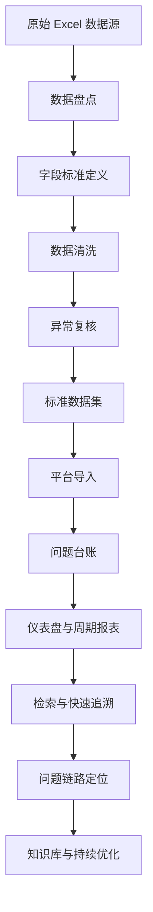

# LONTRI 项目运维记录数据清洗执行模板

> 适用对象：`docs/LONTRI项目运维记录持续更新.xlsx` 及后续同类运维记录数据源  
> 目标：先完成数据治理与口径统一，再推进运维记录平台、仪表盘、报表、检索追溯、问题链路定位等建设  
> 建议版本：V1.0  
> 建议使用方式：先按本文建立 Excel 清洗工作簿或清洗台账，再启动平台正式导入

---

## 1. 文档定位

这份模板不是概念说明，而是面向落地执行的“数据清洗操作底稿”。

你可以把它理解成三件事的结合：

1. 数据标准定义
2. 数据清洗规则清单
3. 平台建设前的验收标准

如果这一步做扎实，后面的日报、周报、月报、年报、检索、追溯、漏斗式定位，都会稳定很多。

---

## 2. 总体路线图

---

## 3. 推荐执行原则

1. 原始数据永不覆盖，只复制，不直接改原表。
2. 先统一口径，再做补录和合并。
3. 不确定的数据进入人工复核，不强行判断。
4. 清洗后字段要可统计、可检索、可追溯。
5. 每条记录都尽量保留来源信息：`文件名 + Sheet + 行号 + 原始文本`。
6. 所有“自动修正”都要可解释，最好能说明规则依据。
7. 去重不等于删除，要能回看“为什么判定为重复”。
8. 平台指标口径要和清洗口径保持完全一致。

---

## 4. 建议先搭一套清洗工作簿

建议你在 Excel 里至少建立以下 Sheet：

| Sheet 名称 | 用途 | 是否必须 |
|---|---|---|
| `RAW_ISSUE` | 原始问题记录镜像，不改动 | 是 |
| `RAW_CONTACT` | 原始联系人镜像 | 是 |
| `RAW_WARRANTY` | 原始合同与质保镜像 | 是 |
| `RAW_CATEGORY` | 原始分类镜像 | 是 |
| `MAP_PROJECT` | 项目别名与标准名映射 | 是 |
| `MAP_PERSON` | 人员别名与标准名映射 | 是 |
| `MAP_CATEGORY` | 分类映射表 | 是 |
| `MAP_STATUS` | 状态映射表 | 是 |
| `CLEAN_ISSUE` | 清洗后的问题数据 | 是 |
| `REVIEW_QUEUE` | 待人工复核记录 | 是 |
| `DUP_CHECK` | 重复问题识别清单 | 建议 |
| `QUALITY_REPORT` | 数据质量统计与验收结果 | 建议 |

---

## 5. 数据分层建议

建议把数据治理拆成 4 层：

### 5.1 原始层 RAW

作用：
- 保留原始内容
- 作为追溯依据
- 不参与统计口径

要求：
- 不直接修改
- 保留原始 Sheet 名
- 保留原始行号

### 5.2 清洗层 CLEAN

作用：
- 去空格、去无效字符
- 日期格式统一
- 状态和分类标准化
- 人员和项目名称归一

要求：
- 每个清洗字段最好保留对应原始字段
- 标记自动处理还是人工处理

### 5.3 标准层 STANDARD

作用：
- 形成可导入平台的标准结构
- 作为报表、检索、仪表盘的统一来源

要求：
- 字段口径固定
- 枚举值固定
- 可直接入库或导入

### 5.4 复核层 REVIEW

作用：
- 承接无法自动判断的记录
- 保障最终数据质量

典型进入条件：
- 缺发现时间
- 状态无法识别
- 项目归属不明
- 描述过短无法判断
- 疑似重复但无法自动合并

---

## 6. 问题记录标准字段模板

这是后续平台最关键的一张表。建议你把 Excel 里的问题记录先清成下表结构。

| 字段名 | 中文名 | 类型 | 是否必填 | 说明 |
|---|---|---|---|---|
| `source_file` | 来源文件 | 文本 | 是 | 如 `LONTRI项目运维记录持续更新.xlsx` |
| `sheet_name` | 来源工作表 | 文本 | 是 | 原始 Sheet 名 |
| `row_no` | 来源行号 | 数值 | 是 | 原始行号 |
| `source_id` | 来源唯一标识 | 文本 | 否 | 如原表已有编号可保留 |
| `project_name_raw` | 原始项目名 | 文本 | 是 | 原值 |
| `project_name_std` | 标准项目名 | 文本 | 是 | 清洗后标准项目名 |
| `project_code` | 项目编码 | 文本 | 是 | 平台统一编码 |
| `customer_std` | 标准客户名 | 文本 | 否 | 客户口径统一后填写 |
| `category_raw` | 原始分类 | 文本 | 否 | 原值 |
| `category_l1` | 一级分类 | 文本 | 是 | 标准分类 |
| `category_l2` | 二级分类 | 文本 | 否 | 标准分类 |
| `category_l3` | 三级分类 | 文本 | 否 | 标准分类 |
| `found_at_raw` | 原始发现时间 | 文本 | 是 | 原值 |
| `found_at_std` | 标准发现时间 | 日期时间 | 是 | `yyyy-MM-dd HH:mm:ss` |
| `completed_at_raw` | 原始完成时间 | 文本 | 否 | 原值 |
| `completed_at_std` | 标准完成时间 | 日期时间 | 否 | 完成时填写 |
| `description_raw` | 原始问题描述 | 文本 | 是 | 原值 |
| `description_std` | 标准问题现象 | 文本 | 是 | 清洗后描述 |
| `impact_scope_std` | 影响范围 | 文本 | 否 | 如楼栋、区域、设备范围 |
| `severity_std` | 严重程度 | 枚举 | 否 | 建议统一分级 |
| `priority_std` | 优先级 | 枚举 | 否 | 建议统一分级 |
| `owner_raw` | 原始责任人 | 文本 | 否 | 原值 |
| `owner_std` | 标准责任人 | 文本 | 否 | 名称统一后值 |
| `owner_role` | 责任角色 | 枚举 | 否 | 运维/现场/厂家/售后等 |
| `current_status_std` | 当前状态 | 枚举 | 是 | `OPEN / IN_PROGRESS / CLOSED` |
| `closure_status_std` | 闭环状态 | 枚举 | 是 | `OPEN / CLOSED` |
| `latest_progress_std` | 最新进展 | 文本 | 否 | 当前最近处理进展 |
| `root_cause_l1` | 一级根因 | 文本 | 否 | 后续可补充 |
| `root_cause_l2` | 二级根因 | 文本 | 否 | 后续可补充 |
| `solution_std` | 解决动作 | 文本 | 否 | 建议从进展中提炼 |
| `result_std` | 处理结果 | 文本 | 否 | 恢复正常/待观察等 |
| `dedupe_key` | 去重键 | 文本 | 是 | 用于识别重复 |
| `review_flag` | 是否需复核 | 枚举 | 是 | `Y / N` |
| `review_reason` | 复核原因 | 文本 | 否 | 记录需人工介入原因 |
| `raw_snapshot` | 原始快照 | 文本 | 否 | 便于追溯 |

---

## 7. 主数据标准建议

### 7.1 项目主数据

建议建立 `MAP_PROJECT` 映射表：

| alias_project_name | std_project_name | project_code | customer_std | status |
|---|---|---|---|---|
| ABBP6项目 | ABBP6项目 | ABBP6 | ABB | 启用 |
| ABB P6 | ABBP6项目 | ABBP6 | ABB | 启用 |
| P6 | ABBP6项目 | ABBP6 | ABB | 启用 |

规则：
- 同一项目只能保留一个标准名
- 同一项目只能保留一个项目编码
- 历史简称、错别字、旧名称都进入别名映射

### 7.2 人员主数据

建议建立 `MAP_PERSON` 映射表：

| alias_person_name | std_person_name | role_type | org_type | status |
|---|---|---|---|---|
| 张工 | 张三 | 运维负责人 | 内部 | 启用 |
| 厂家张工 | 张三 | 厂家支持 | 外部 | 启用 |
| 现场处理人张三 | 张三 | 现场处理 | 内部 | 启用 |

规则：
- 一个人只保留一个标准姓名
- 角色可以多值，但姓名口径必须统一

### 7.3 分类主数据

建议建立 `MAP_CATEGORY`：

| raw_category | category_l1 | category_l2 | category_l3 | remark |
|---|---|---|---|---|
| 门禁异常 | 门禁系统 | 控制器 | 通讯异常 | 自动映射 |
| 读卡器故障 | 门禁系统 | 读卡设备 | 设备故障 | 自动映射 |
| 平台无法登录 | 平台系统 | 账号权限 | 登录失败 | 自动映射 |

建议一级分类方向：
- 平台系统
- 网络通信
- 门禁系统
- 视频监控
- 设备硬件
- 数据同步
- 权限账号
- 第三方接口
- 巡检维护
- 其他待确认

### 7.4 状态主数据

建议统一成两套字段：

| 原始表达 | 当前状态 `current_status_std` | 闭环状态 `closure_status_std` | 备注 |
|---|---|---|---|
| 待处理 | OPEN | OPEN | 未开始 |
| 待确认 | OPEN | OPEN | 待进一步判断 |
| 处理中 | IN_PROGRESS | OPEN | 正在排查或修复 |
| 跟进中 | IN_PROGRESS | OPEN | 视为处理中 |
| 已恢复 | CLOSED | CLOSED | 已闭环 |
| 已完成 | CLOSED | CLOSED | 已闭环 |
| 已关闭 | CLOSED | CLOSED | 已闭环 |
| 待观察 | IN_PROGRESS | OPEN | 建议不要直接视为关闭 |

---

## 8. 核心清洗规则

### 8.1 文本清洗规则

| 规则编号 | 规则名称 | 处理方式 |
|---|---|---|
| T01 | 去首尾空格 | 所有文本字段统一去首尾空格 |
| T02 | 合并连续空格 | 多个空格转一个空格 |
| T03 | 去无意义换行 | 将无意义换行替换为空格 |
| T04 | 全角半角统一 | 标点尽量统一 |
| T05 | 空字符串归空值 | `""`、`-`、`/`、`无`按规则处理 |
| T06 | 保留原始描述 | 清洗后描述不能覆盖原始描述 |

### 8.2 日期清洗规则

| 规则编号 | 场景 | 建议处理 |
|---|---|---|
| D01 | 标准日期时间 | 直接转为 `yyyy-MM-dd HH:mm:ss` |
| D02 | 只有日期无时间 | 默认补 `00:00:00`，并标记来源 |
| D03 | 只有年月日中的月日 | 结合上下文年份推断，无法确认则复核 |
| D04 | 只有年月 | 默认补为当月 1 日，进入备注 |
| D05 | 完成时间早于发现时间 | 强制进入复核 |
| D06 | 无法解析日期 | `review_flag=Y` |

### 8.3 状态清洗规则

| 规则编号 | 场景 | 建议处理 |
|---|---|---|
| S01 | 原状态为空但进展表明处理中 | 置为 `IN_PROGRESS`，备注“由进展推断” |
| S02 | 有完成时间但状态未关闭 | 置为 `CLOSED/CLOSED`，并标记自动修正 |
| S03 | 状态写“待观察” | 置为 `IN_PROGRESS/OPEN` |
| S04 | 状态无法识别 | 进入复核 |
| S05 | 进展写“已恢复正常” | 可推断为 `CLOSED/CLOSED`，但保留原文 |

### 8.4 项目清洗规则

| 规则编号 | 场景 | 建议处理 |
|---|---|---|
| P01 | 项目简称 | 通过 `MAP_PROJECT` 映射到标准名 |
| P02 | 项目名称有错别字 | 修正到标准名 |
| P03 | 无法识别项目 | 进入复核 |
| P04 | 一个记录出现多个项目名 | 进入复核，不自动拆分 |

### 8.5 人员清洗规则

| 规则编号 | 场景 | 建议处理 |
|---|---|---|
| U01 | 张工/李工类简称 | 映射到标准姓名 |
| U02 | 同时含姓名和角色 | 姓名与角色拆分为两个字段 |
| U03 | 厂家/售后/现场前缀 | 保留到角色字段，姓名统一 |
| U04 | 无法判断具体责任人 | 可留空，但记录复核原因 |

### 8.6 分类清洗规则

| 规则编号 | 场景 | 建议处理 |
|---|---|---|
| C01 | 原表已有分类 | 映射到三级标准分类 |
| C02 | 原表无分类但描述可判断 | 允许人工补分类 |
| C03 | 描述过短无法判断 | 进入复核 |
| C04 | 一个问题涉及多个分类 | 先保留主分类，其他写备注 |

### 8.7 去重规则

建议先不要做“物理删除”，先做“重复识别”。

推荐 `dedupe_key` 组成方式：

`标准项目 + 发现日期 + 标准问题现象 + 可选设备/区域`

| 规则编号 | 场景 | 建议处理 |
|---|---|---|
| R01 | 同项目、同日、同描述 | 标记疑似重复 |
| R02 | 同项目、相邻日期、同描述 | 标记高相似，人工确认 |
| R03 | 同问题多次跟进记录 | 不视为重复，视为同一问题时间线 |
| R04 | 同现象但不同区域/设备 | 通常不合并 |

---

## 9. 人工复核队列模板

建议 `REVIEW_QUEUE` 至少包含下面字段：

| 字段名 | 说明 |
|---|---|
| `review_id` | 复核编号 |
| `source_file` | 来源文件 |
| `sheet_name` | 来源 Sheet |
| `row_no` | 行号 |
| `project_name_raw` | 原始项目 |
| `description_raw` | 原始描述 |
| `issue_type` | 复核类型 |
| `review_reason` | 复核原因 |
| `suggested_value` | 系统建议值 |
| `final_value` | 人工确认值 |
| `reviewer` | 复核人 |
| `review_time` | 复核时间 |
| `review_result` | 通过/修改/驳回 |

常见复核类型：
- 项目不明
- 日期不明
- 状态冲突
- 分类不明
- 责任人不明
- 疑似重复
- 文本信息不足

---

## 10. 数据质量验收标准

建议你把“什么时候算清洗完成”写清楚，否则这件事会一直拖。

### 10.1 基础验收线

| 指标 | 建议目标 |
|---|---|
| 项目标准化覆盖率 | 100% |
| 状态标准化覆盖率 | 100% |
| 关键字段完整率 | 90% 以上 |
| 发现时间可解析率 | 95% 以上 |
| 分类标准化覆盖率 | 95% 以上 |
| 重复问题识别完成率 | 95% 以上 |
| 需复核记录闭环率 | 100% |

### 10.2 关键字段完整性

问题记录建议以下字段作为“准入必备字段”：

- `project_name_std`
- `project_code`
- `found_at_std`
- `description_std`
- `current_status_std`
- `closure_status_std`
- `dedupe_key`

如上述字段缺失，建议不要直接导入正式问题台账。

### 10.3 逻辑一致性校验

导入前建议至少检查：

1. 完成时间不能早于发现时间
2. 已关闭状态原则上应存在完成时间或明确恢复结果
3. 项目编码与项目标准名必须一一对应
4. 同一别名不能映射到多个标准项目
5. 同一去重键的记录要人工确认是否重复

---

## 11. 平台建设建议顺序

数据清理完成后，推荐按下面顺序推进，而不是同时铺开所有功能。

### 第一阶段：数据治理版平台

目标：
- 能导入
- 能复核
- 能形成标准问题台账
- 能保留来源追溯

优先功能：
- 导入批次管理
- 行级复核
- 问题台账
- 项目字典
- 分类字典
- 状态字典

### 第二阶段：指标与报表

目标：
- 建统一指标层
- 支撑日报、周报、月报、年报

优先指标建议：
- 新增问题数
- 已关闭问题数
- 未闭环问题数
- 关闭率
- 平均处理时长
- 超时问题数
- 项目分布
- 分类分布
- 责任人分布

### 第三阶段：检索与追溯

目标：
- 快速找到问题
- 快速看到全链路

优先能力：
- 关键词检索
- 按项目/时间/分类/责任人筛选
- 查看单问题处理时间线
- 回看导入来源与原始记录
- 相似问题召回

### 第四阶段：问题链路定位

目标：
- 像漏斗一样快速收敛排查范围

建议漏斗维度：
- 现象
- 项目
- 系统/设备
- 时间窗口
- 分类
- 状态
- 责任人
- 根因
- 处置动作
- 恢复结果

### 第五阶段：知识库与预警

目标：
- 从问题处理，升级到经验沉淀和主动预防

建议内容：
- 标准案例库
- 标准排查 SOP
- 根因标签库
- 预警规则库
- 常见问题处理建议

---

## 12. 日报、周报、月报、年报的口径建议

不要做四套逻辑，建议做“一套指标定义，多时间粒度输出”。

### 12.1 基础指标定义

| 指标 | 定义建议 |
|---|---|
| 新增问题数 | 在统计周期内 `found_at_std` 落入区间的问题数 |
| 关闭问题数 | 在统计周期内 `completed_at_std` 落入区间且闭环的问题数 |
| 存量未闭环数 | 统计截止时 `closure_status_std=OPEN` 的问题数 |
| 平均处理时长 | 已闭环问题 `completed_at_std - found_at_std` 的平均值 |
| 超时问题数 | 超出约定时限仍未闭环的问题数 |
| 重复问题占比 | 被识别为重复的问题数占比 |
| 高发分类 TOPN | 按分类统计问题数排名 |

### 12.2 报表输出建议

日报重点：
- 当日新增
- 当日关闭
- 当日重点未闭环
- 当日异常高发点

周报重点：
- 趋势
- 分类排行
- 项目排行
- 责任人负载
- 超时问题

月报重点：
- 总量趋势
- 闭环效率
- 根因分布
- 重复问题治理情况
- 典型案例复盘

年报重点：
- 年度趋势
- 项目对比
- 高风险类别
- 关键改进事项
- 知识沉淀成果

---

## 13. 推荐的清洗推进节奏

如果你准备亲自先清洗数据，建议按下面节奏推进：

### 第 1 步：盘点原始字段

输出：
- 原始字段清单
- 哪些 Sheet 是问题、联系人、合同、分类
- 哪些字段是真正可用的

### 第 2 步：确定标准字段

输出：
- 标准问题字段模板
- 主数据字典草案
- 状态口径说明

### 第 3 步：先做 50 条样本清洗

目的：
- 验证规则是否能跑通
- 发现最容易冲突的字段

输出：
- 样本清洗版
- 复核问题清单

### 第 4 步：补齐映射表

输出：
- 项目映射表
- 人员映射表
- 分类映射表
- 状态映射表

### 第 5 步：批量清洗

输出：
- `CLEAN_ISSUE`
- `REVIEW_QUEUE`
- `DUP_CHECK`

### 第 6 步：验收并冻结第一版标准数据

输出：
- 标准数据集 V1
- 数据质量报告 V1
- 平台导入范围

---

## 14. 你现在最需要先做的 3 份底稿

如果时间有限，先把下面 3 份做出来，价值最大：

### 14.1 数据字典

至少包含：
- 项目标准名
- 项目编码
- 分类体系
- 状态口径
- 人员标准名

### 14.2 清洗规则表

至少包含：
- 字段名
- 原始问题
- 处理规则
- 是否自动清洗
- 是否需人工复核

### 14.3 异常复核表

至少包含：
- 哪条记录异常
- 为什么异常
- 建议如何修
- 最终确认结果

---

## 15. 建议你暂时不要急着做的事情

在数据口径没稳定前，建议先不要重投入以下内容：

1. 复杂大屏
2. 过多自定义图表
3. 高级链路分析算法
4. 自动根因识别
5. 复杂全文检索优化

原因很简单：底层数据还不稳定时，这些功能看起来很强，实际容易失真。

---

## 16. 执行结论

对你这个项目来说，最专业、也最省返工的路线是：

`先做数据源治理 -> 再做标准问题台账 -> 再做统一指标层 -> 再做检索追溯 -> 再做漏斗定位 -> 最后做知识库和预警`

一句话判断标准：

如果一条历史运维记录，不能被稳定地回答下面这些问题，就说明还没清干净：

1. 它属于哪个标准项目
2. 它是什么标准分类
3. 它什么时候发现
4. 它现在处于什么状态
5. 它是否已经闭环
6. 它是谁负责
7. 它和别的问题是否重复或关联
8. 它能不能进入统计和报表

只要这 8 个问题能稳定回答，平台建设就会顺很多。

---

## 17. 附：可直接复用的清洗任务清单

你可以按下面顺序一项项执行：

- 建立 `RAW / CLEAN / REVIEW` 三层工作簿结构
- 盘点所有 Sheet 与原始字段
- 整理项目标准名和项目编码
- 整理人员别名与标准名
- 整理分类字典
- 整理状态映射规则
- 统一时间格式
- 统一问题描述格式
- 建立去重规则
- 输出疑难记录到复核池
- 形成第一版标准数据集
- 做质量验收
- 冻结 V1 数据口径
- 再进入平台导入与功能建设

